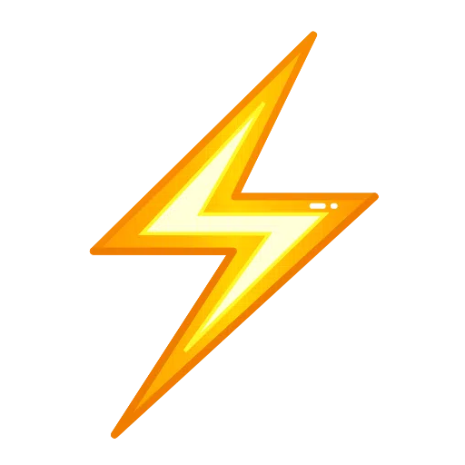

<h4><a href="https://www.franekkaminski.dev/">Portfolio &amp; Contact</a>&ensp;</h4>

<h4>About Me&ensp;</h4>

Full Stack AI Developer with a background in e-commerce, entrepreneurship and consulting. I enjoy building modern web applications, AI-powered workflows and digital products that solve real business problems.

<h4>Currently working on&ensp;</h4>

- **[Ultralink](https://ultralink.bio)** — Live SaaS: Link-in-bio website builder for influencers (see portfolio for details)
- Full Stack Development Skills, specifially: React, Next.js, Supabase, PostgreSQL
- AI-powered applications & workflow automations
- More Full Stack AI projects

<h4>Favourite Tech&ensp;</h4>

<strong>Frontend</strong>&ensp;

<strong>Backend</strong>&ensp;

